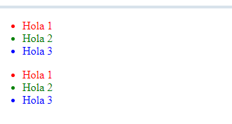
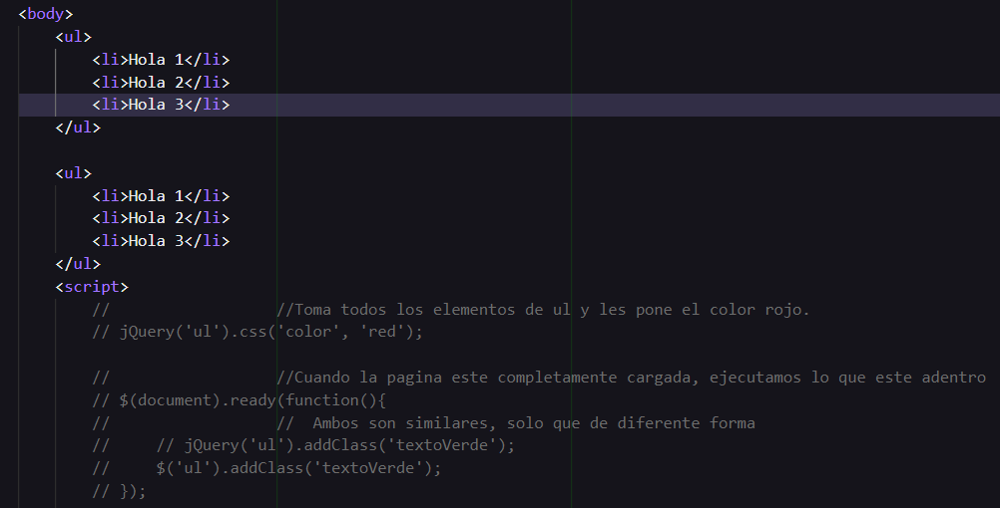

# UDY-JQueryCeroAAvanzado

`EL CURSO ESTA MUY VIEJO POR LO TANTO YA NO SE PROSIGUIO CON PRACTICAR`, mejor se tomo un curso en Youtube
https://github.com/cesarluilly/YOUT-CursoJQuery
https://www.youtube.com/watch?v=_0ovL38ixpU&list=PL_wRgp7nihyY020gyukDupJEJ84gimiPS&index=2

